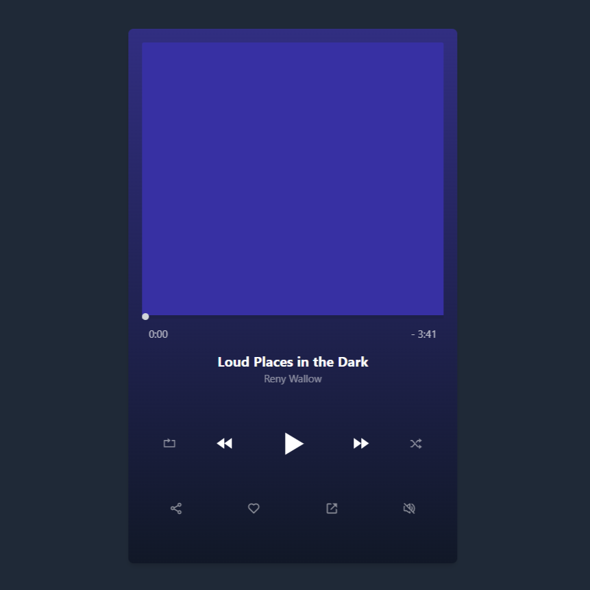

# Music Player App

App designed using ReactJS with TypeScript. Styled with Tailwind CSS. Slider animations created with Framer Motion. You can take a look at the design [here](https://music-player-app-d0954.web.app/).

Copied the project idea from [Sam Selikoff](https://twitter.com/samselikoff) and one of his Framer Motion tutorials. Take a look at his [Youtube Channel](https://www.youtube.com/c/SamSelikoff).

## Let's chat!

I love learning new stuff, so any comments or suggestions are most welcomed.

Also, I love coffee. If you are around, we might try to do one those virtual coffee hangouts (it's totally a thing). Just hit me up!

## Author

- Website - [Erwin Méndez](https://soyerwin.com)
- Twitter - [@ErwinRMendez](https://twitter.com/ErwinRMendez)
